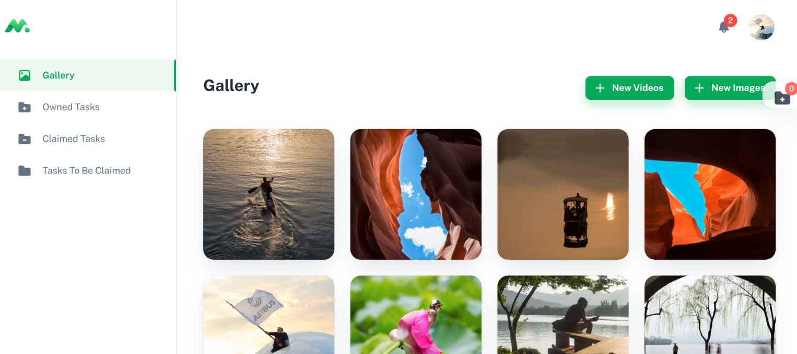
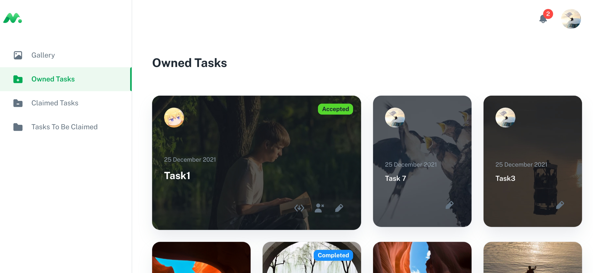
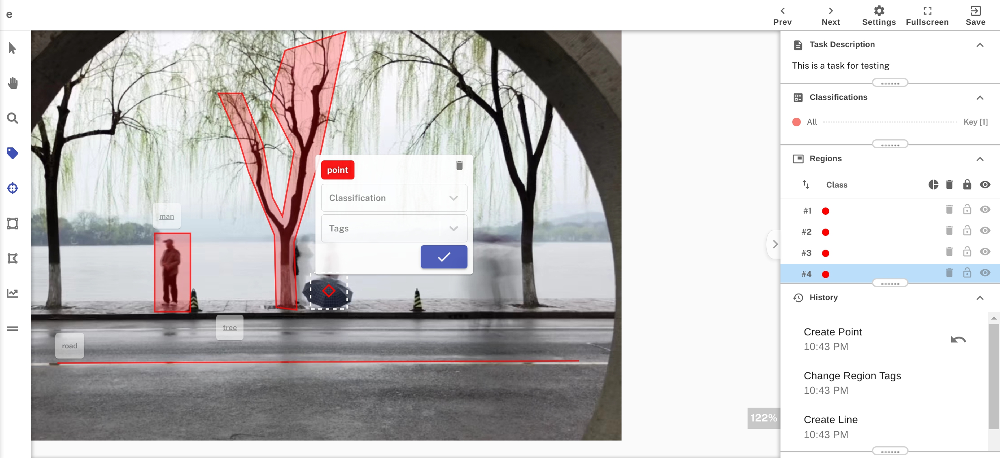

# Annotator-BS2021
A image annotation website in React and Rust -- a course project for Browser/Server Course at ZJU.

## Features

* Images and videos upload
* Image annotation
* Export to Pascal VOC format and COCO format

